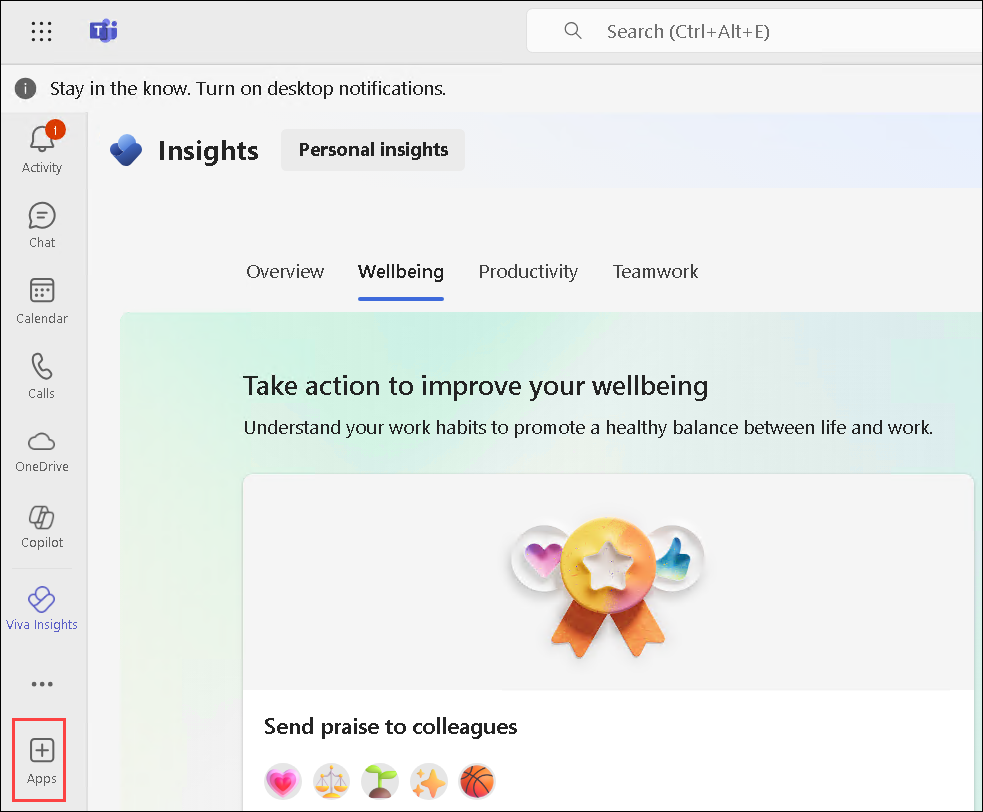
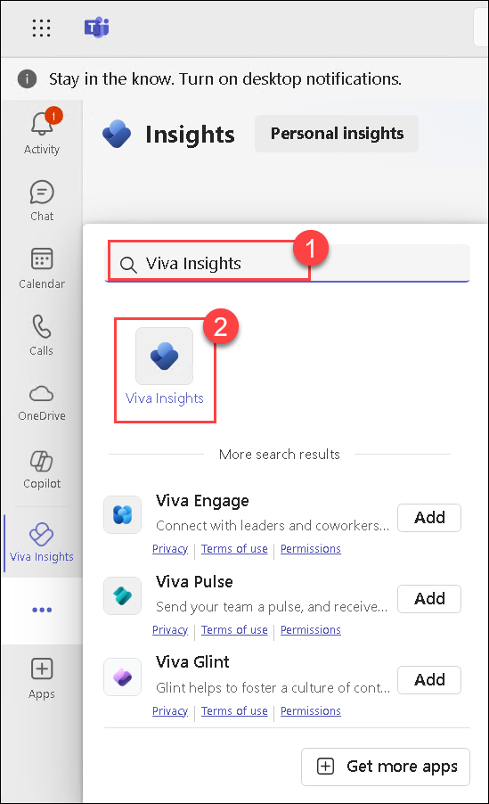
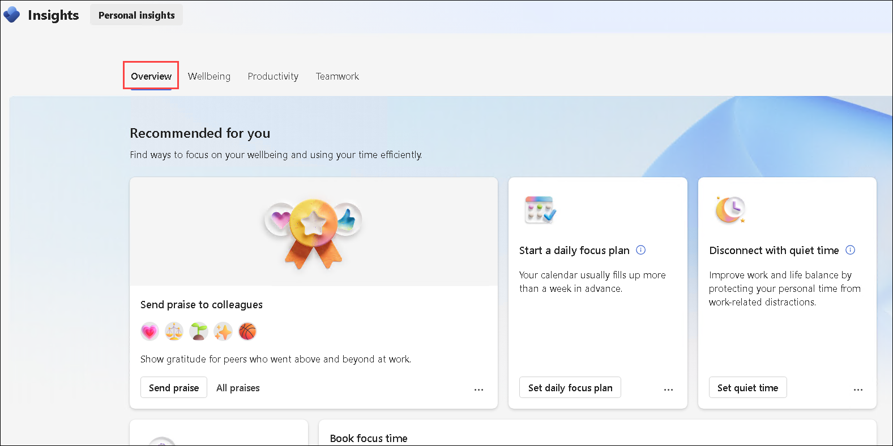
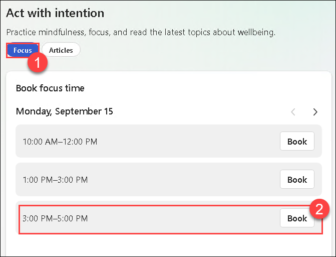
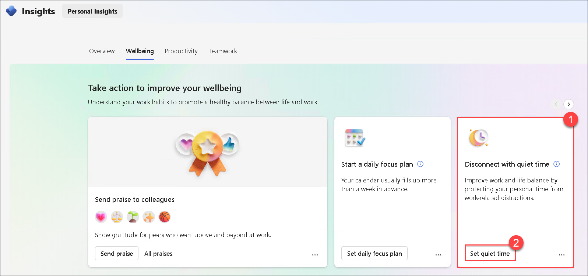
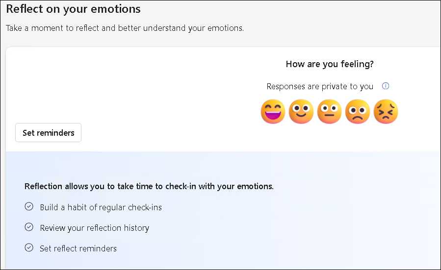
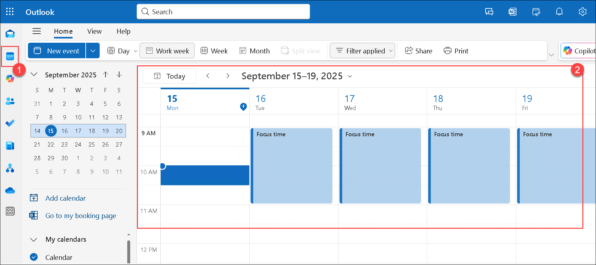

# Day 01: Improve productivity and wellbeing of employees with Viva Insights

### Estimated Duration: 60 minutes

## Lab Overview
In this lab, you will explore how Microsoft Viva Insights can enhance productivity and employee wellbeing by setting up a personal wellbeing plan, configuring focus and quiet time, sending praise to colleagues, reflecting on emotions, and tracking progress within Teams. If licensed as a manager, you will also learn how to access Manager Insights to view aggregated team-level data on collaboration overload, after-hours work, and team cohesion, and then translate these insights into actionable steps to improve work-life balance.  

## Lab Objective

In this lab, you will perform the following:
- Task 1: Configure a wellbeing plan in Viva Insights
- Task 2: Explore Viva Insights in Teams
- Task 3: Configure Manager Insights for a Team
  
## Task 1: Configure a wellbeing plan in Viva Insights

1. Open Microsoft Teams and click on the **Apps** button (bottom-left sidebar).  

    

2. Search for **Viva Insights (1)** and select it to add it to Teams. 

    

3. Once inside Viva Insights, navigate to the **Home dashboard** where you will see your daily productivity metrics such as meeting hours, focus hours, and collaboration trends.  

    

4. Go to the **Wellbeing (1)** tab.  

    - Configure your wellbeing plan:  

    - **Focus Time (1)**: Select the preferred number of focus hours per day (e.g., 2 hours **(2)**) and allow Insights to automatically block your calendar. This prevents distractions from meetings or chats.  

        

    - **Quiet Time Preferences**: Define after-work hours and weekends as “quiet time” to mute Teams/Outlook notifications. For example, set weekdays 6:00 PM – 8:00 AM and weekends fully quiet.  

        

    - **Daily Reflection Prompts**: Enable mood check-ins where Viva asks you how you feel at the start/end of the day. This builds self-awareness and tracks wellbeing trends.  

        

5. The settings will be saved automatically. From the app launcher above, select Outlook and check your **Outlook calendar (1)** to confirm that **Focus (2)** time blocks appear automatically. 

    >**Note:** After a few days, revisit Insights to observe how your wellbeing settings impact your productivity graph.  

    

## Task 2: Explore Viva Insights in Teams

1. Open the **Viva Insights app** again from Teams.  

2. On the **Personal Insights dashboard**, carefully explore the sections: 

    - **Send Praise to Colleagues**:  
        - Click *Send Praise* to recognize teammates who went above and beyond.  
        - Choose from badges such as teamwork, leadership, creativity, etc.  
        - This praise appears in Teams chat and builds a positive culture.  

    - **Start a Daily Focus Plan**:  
        - Configure recurring focus hours so your calendar automatically blocks uninterrupted time.  
        - These focus blocks help reduce distractions from Teams notifications and meetings.  
        - You can edit which days of the week focus hours should be booked.  

    - **Disconnect with Quiet Time**:  
        - Set after-hours and weekend quiet hours.  
        - During this period, Teams and Outlook notifications are silenced to promote work-life balance.  
        - Example: Quiet time from 6:00 PM – 8:00 AM on weekdays, and full weekends.  

    - **Track Your Progress**:  
        - See a weekly summary of how many days you successfully followed your focus plan.  
        - Blue dots indicate scheduled focus days.  
        - Use this to monitor consistency and build long-term habits.  

    - **Act with Intention (Focus Time Booking)**:  
        - Manually book focus sessions into your calendar.  
        - You can add multiple blocks per day (e.g., 11:00–1:00, 2:00–4:00).  
        - Confirm they appear as “Focus Time” in your Outlook calendar.  

    - **Reflect on Your Emotions**:  
        - Daily mood check-in with emojis (😊 😍 😐 😞 😡).  
        - Track emotional patterns over time and identify stress triggers.  
        - The reflection history chart lets you review trends over days/weeks. 

    - Take a moment to click on each recommendation and note how Viva helps you take immediate action (e.g., reschedule or shorten a meeting). 

## Task 3: Configure Manager Insights for a Team

- If you are logged in with manager permissions:  
  - Navigate to the **Manager view** in Viva Insights.  
  - Explore the following metrics provided:  
    - **Collaboration Overload**: Average weekly meeting hours per employee, after-hours chats, and email volume.  
    - **Wellbeing Indicators**: Frequency of late-night or weekend work.  
    - **Team Cohesion**: How much time employees spend collaborating within vs. outside the team.  
- Create a **custom query/report**:  
  - Example: Check how many hours your team spends in meetings longer than 1 hour.  
  - Use the built-in filters to refine results (e.g., by department or timeframe).  
- Export this report to Excel/CSV for analysis.  
- Based on the data, prepare a mini action plan. For example:  
  - Reduce recurring 1-hour meetings to 30 minutes.  
  - Encourage “focus hours” adoption across the team.  
  - Share wellbeing resources if after-hours work is too frequent.

## Summary
In this lab, you have completed the following tasks:

- Configured a wellbeing plan in Viva Insights
- Explored Viva Insights in Teams
- Configured Manager Insights for a Team

### You have successfully completed the lab. Click on **Next >>** to proceed with the next Lab.

