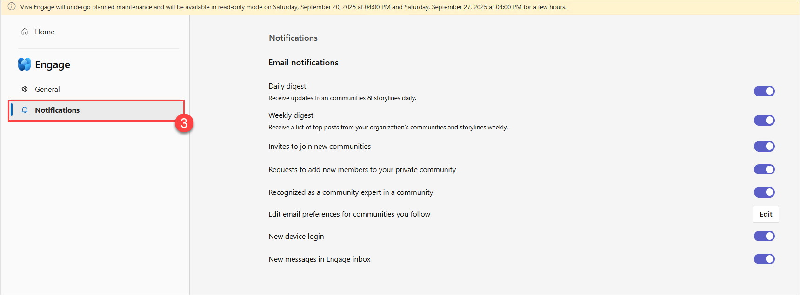

# Day 02: Shape Culture and Foster Connections with Viva Connections and Viva Engage

### Estimated Duration: 60 minutes

## Lab Overview
In this lab, you will explore how to strengthen culture and connections using Viva Connections and Viva Engage. You will create a Viva Connections dashboard with company news, resources, and apps inside Teams, and configure the feed to surface updates from SharePoint, Teams, and Engage. You will also set up and manage a Viva Engage community, test conversations across Teams, and enable features like storylines and leadership corner. By the end, you will have hands-on experience building a central hub that promotes engagement and collaboration.   

## Lab Objective

In this lab, you will perform the following:
- Task 1: Create and launch a Viva Connections dashboard and feed
- Task 2: Create and manage a Viva Engage community
- Task 3: Test Viva Engage conversations in Teams
- Task 4: Configure Viva Engage features
  
## Task 1: Create and launch a Viva Connections dashboard and feed

In this task, you will create and customize a Viva Connections dashboard with cards and configure the feed to surface news and updates inside Teams.

1. Open the Microsoft 365 admin center in your browser. From the left navigation menu, select **Show all (1)**, then select **SharePoint (2)**. This will open a new browser window with the **SharePoint admin center**.

    

    

2. On the **SharePoint admin center** → **Settings (1)** → **Home site (2)**.  

    

3. On the **Home site set up has moved to Viva Connections in the Microsoft 365 admin center** pop-up select, **Go to Microsoft 365 admin center**.

    

4. You will be navigated to the **Micrsoft Viva** page. On the **Viva Connections experiences**, select **+ Create new**.

    

5. On the **Create a new Viva Connections experience** pop-up, select **Create a Connections experience (1)**, and select **Next (2)**.

    

6. On the **Set up your Viva Connections experience**, enter the folowing details, and select **Next (5)**:

    - **Name (1)**: Employee Hub
    - **Description (2)**: A central hub for company news, resources, and teamwork in Microsoft Teams.
    - **Default language (3)**: English
    - **Timezone (4)**: (UTC+05:30) Chennai, Kolkata, Mumbai, New Delhi

        

7. On the **Review and finish** page, select **Create experience**. Once created close the pane.

    

8. Once the connection is created, select the newly created connection, edit its status to Enabled, and save the changes.

9. This becomes the entry point for Viva Connections in Teams. From the **App launcher (1)** select **Connections (2)**.

    

10. On the Viva Connections **Dashboard**, select **Edit**. 

    

11. Create dashboard cards by selecting **+ Add a card**. Add the cards listed below, or choose the ones you find relevant and want to include in your connections.:  

    - **News card** → pulls announcements from SharePoint News.  

    - **Links** → links to HR policy library.

    - **Power Apps card** → embed a custom app (e.g., Leave Request). 

       

12. Rearrange the cards to highlight the most important items first, and select **Save as draft**.

     

13. Publish the Viva Connections experience.  

     

14. Finally, open **Microsoft Teams**, select **Apps (1)**  and add the **Connections (2)**.  

    

15. Preview how the home site + dashboard cards + feed appear for end users.  

## Task 2: Create and manage a Viva Engage community

In this task, you will set up a Viva Engage community, define its settings, and encourage collaboration with posts and resources.

1. Navigate to **Microsoft 365 admin center**, select the **App launcher (1)**, and select **Engage (2)** from the options.

    

2. From the left navigation menu, click **Communities (1)** and **+ Create a Community (2)**. 

3. For creating the new community, follow the below instructions, and select **Create (5)**:

    - **Name (1)**: Innovation Hub  
    - **Description (2)**: A space to share and discuss new ideas.
    - **Members (3)**: anyone can join.  
    - **Select public or private community (4)**: Edit → Select Private.  

        

4. Post a **welcome message** to introduce the purpose of the community.  

    

5. You can also pin important links/resources (like innovation guidelines or submission forms). Also, Create a **poll** (e.g., “Which area should we focus on for next hackathon?”) to drive engagement.  

## Task 3: Test Viva Engage conversations in Teams

In this task, you will integrate Viva Engage with Teams and test how conversations, mentions, and file sharing flow across both platforms.

1. Open **Microsoft Teams**.

2. From the left bar, click **Apps (1)**, search for **Viva Engage (2)** and add it, if not added. Pin Viva Engage to your Teams navigation for easy access.

     

3. Inside Teams, open your newly created community i.e. **Innovation Hub**.  

    

4. Post a sample message, such as: “Welcome to the Innovation Hub! Share your best ideas here 🚀."
  
5. Use **@mentions** to notify specific team members. 

6. Upload a small file (e.g., idea submission template) to demonstrate document sharing. Select **Post**, after adding all the contents.

    

7. Ask participants to reply — observe how the conversation flows naturally between Teams and Viva Engage web.

## Task 4: Configure Viva Engage features

In this task, you will enable and adjust Viva Engage features such as storylines, leadership corner, and notification settings to enhance engagement.

1. In **Viva Engage app**, explore the following features:  
  
    - **Storylines**:  
    
        - Employees can create posts similar to LinkedIn updates.  

        - Encourage users to share learnings, reflections, or achievements. 

    - **Dashboard**: 

        - A dedicated space for leaders to communicate.  

        - Leaders can post updates, run Q&A sessions, or schedule live events. 

2. To adjust whether members receive email or Teams alerts when someone posts in the community, select the **ellipses (1)** for **ODL_User <inject key="DeploymentID" enableCopy="false"/>**, then go to **Settings (2)** → **Notification preferences (3)**, and adjust the settings.

    
    
        

## Summary
In this lab, you have completed the following tasks:

- Created and launched a Viva Connections dashboard and feed
- Created and managed a Viva Engage community
- Tested Viva Engage conversations in Teams
- Configured Viva Engage features

### You have successfully completed the lab. Click on **Next >>** to proceed with the next Lab.