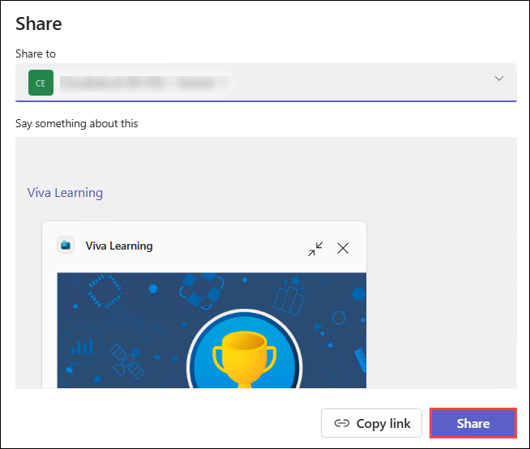

# Day 03: Create Purpose-driven Teams with Viva Goals and Viva Learning

### Estimated Duration: 30 minutes

## Lab Overview
In this lab, you will explore how to use Viva Learning to make learning resources more accessible and integrated into daily work. You will set up Viva Learning inside Microsoft Teams, connect it to content sources such as LinkedIn Learning, Microsoft Learn, or SharePoint, and assign learning content to users or groups. You will also test how employees can discover, share, and track learning directly within Teams, and explore how managers can recommend training to their teams. By the end of this lab, you will have hands-on experience configuring Viva Learning as a centralized hub for skilling and professional development. 

## Lab Objective

In this lab, you will perform the following:
- Task 1: Explore Viva Learning catalog
- Task 2: Assign and track learning content
  
## Task 1: Explore Viva Learning catalog

In this task, you will explore the Viva Learning catalog to discover, search, and filter learning content from different providers.

1. Navigate to Teams app. Open the **Viva Learning** app.

    

2. Browse courses from **LinkedIn Learning, Microsoft Learn, and partner content**. 

3. Search for a topic relevant to your goals (e.g., “Leadership Skills” or “Power BI Fundamentals”).  

4. Bookmark a course and share it in a Teams channel. 

    

    

5. Click a course to view its details page, including description, duration, and provider.

6. Launch the content directly in Teams or in the provider’s site (depending on integration).

7. Select **Save** to bookmark items for later.

8. Use **Share** to recommend a course to colleagues via Teams chat or channel.

9. Go to **My Learning** → check completed or in-progress courses.

## Task 2: Assign and track learning content

In this task, you will assign learning resources to users or groups and track assigned and completed courses within Viva Learning.

1. As a manager, assign a course to your team.  

2. Set a deadline and track completion progress.  

3. Encourage team members to add learning to their Outlook calendar.  

4. Review **completion analytics** to understand adoption and skills development.  

## Summary
In this lab, you have completed the following tasks:

- Explored Viva Learning catalog
- Assigned and tracked learning content

### You have successfully completed the lab. Click on **Next >>** to proceed with the next Lab.

