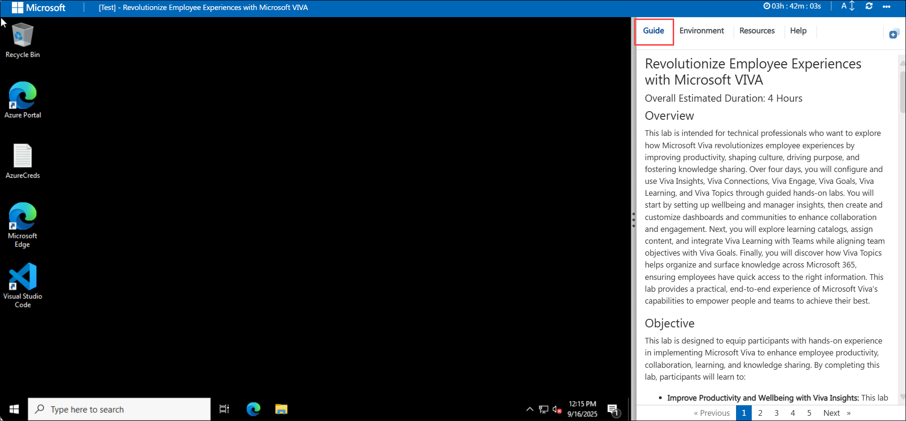
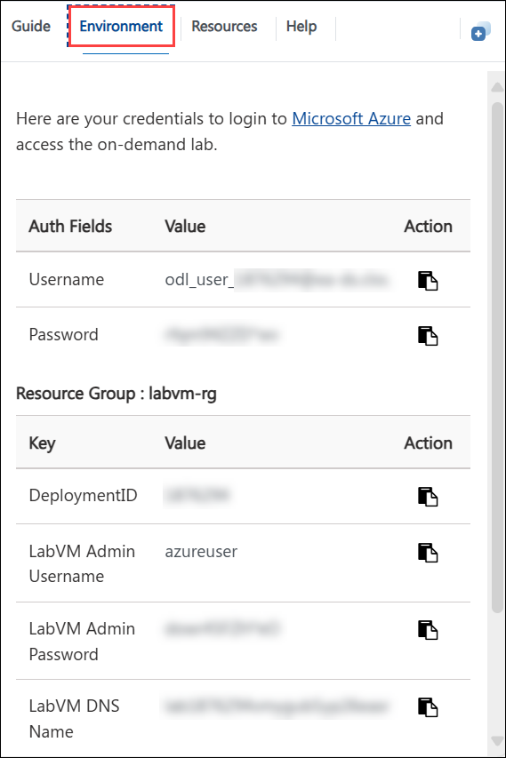
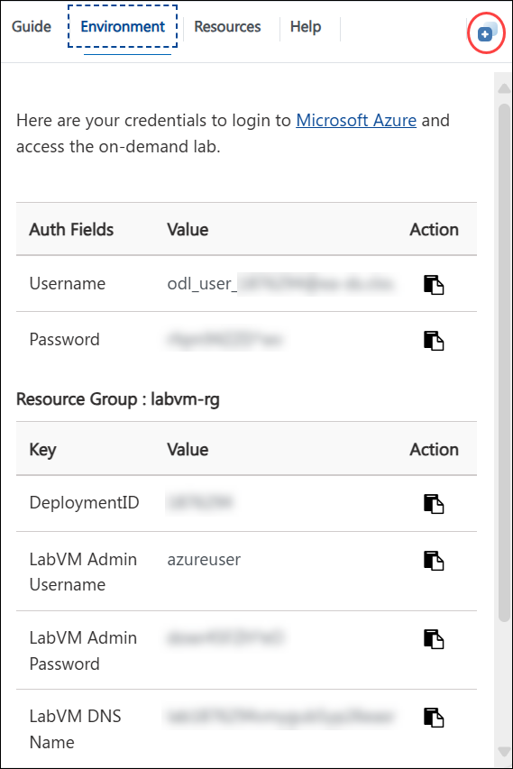
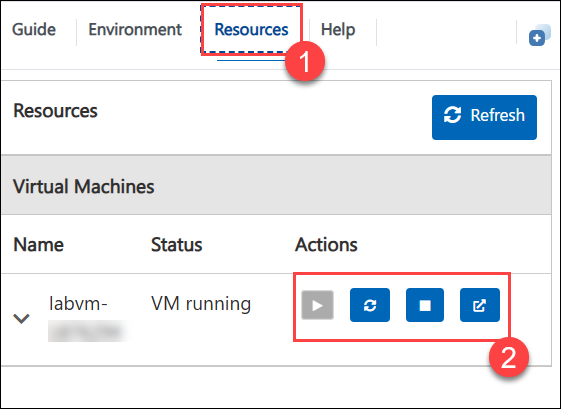
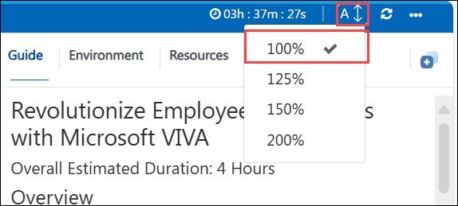
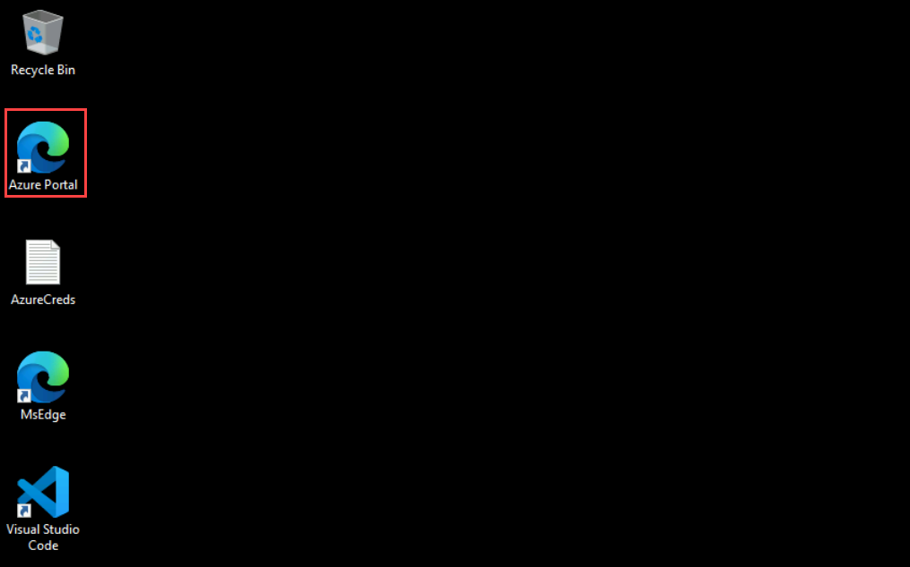
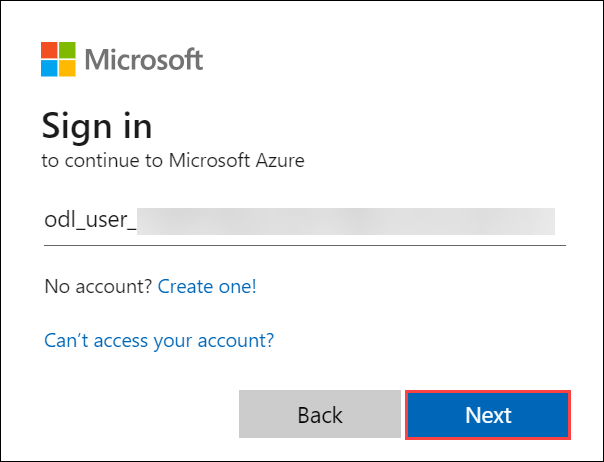

# Revolutionize Employee Experiences with Microsoft VIVA

### Overall Estimated Duration: 4 Hours

## Overview

This lab is intended for technical professionals who want to explore how Microsoft Viva revolutionizes employee experiences by improving productivity, shaping culture, driving purpose, and fostering knowledge sharing. Over four days, you will configure and use Viva Insights, Viva Connections, Viva Engage, Viva Goals, Viva Learning, and Viva Topics through guided hands-on labs. You will start by setting up wellbeing and manager insights, then create and customize dashboards and communities to enhance collaboration and engagement. Next, you will explore learning catalogs, assign content, and integrate Viva Learning with Teams while aligning team objectives with Viva Goals. Finally, you will discover how Viva Topics helps organize and surface knowledge across Microsoft 365, ensuring employees have quick access to the right information. This lab provides a practical, end-to-end experience of Microsoft Viva’s capabilities to empower people and teams to achieve their best.

## Objective 

This lab is designed to equip participants with hands-on experience in implementing Microsoft Viva to enhance employee productivity, collaboration, learning, and knowledge sharing. By completing this lab, participants will learn to:

* **Improve Productivity and Wellbeing with Viva Insights:** This lab focuses on configuring wellbeing plans, exploring personal insights within Teams, and enabling manager insights to analyze collaboration patterns. Participants will gain practical skills in using Viva Insights to balance focus time, track work habits, and drive healthier team productivity.

* **Shape Culture and Foster Connections with Viva Connections and Viva Engage:** This lab provides hands-on experience in building an engaging employee hub through Viva Connections and fostering collaboration with Viva Engage. Participants will create dashboards, configure feeds, launch communities, and test conversations across Teams and Engage, learning how these tools enhance organizational culture.

* **Enhance Learning with Viva Learning:** This lab emphasizes exploring the Viva Learning catalog and assigning relevant learning content to individuals or teams. Participants will practice managing and tracking learning progress to align skill development with organizational needs.

* **Bring Together Knowledge with Viva Topics:** This lab introduces the process of surfacing organizational expertise using Viva Topics. Participants will create and manage topics, link relevant content, and validate how Viva Topics integrates with Microsoft 365 apps. The session ensures learners can transform scattered information into accessible knowledge hubs for employees.

## Prerequisites 

Participants should have:
Basic knowledge and understanding of the following

- Microsoft 365 environment – familiarity with Teams, SharePoint, and Outlook.

- Collaboration tools – understanding of enterprise communication platforms such as Yammer (Viva Engage).

- Organizational scenarios – general knowledge of employee productivity, wellbeing, and learning needs in the workplace.

- Navigation skills – ability to move through Microsoft 365 admin portals and Teams apps.
  
## Getting Started with the Lab

Welcome to your Revolutionize Employee Experiences with Microsoft VIVA Hands-on Workshop! We've prepared a seamless environment for you to explore and learn how Viva empowers organizations to improve employee productivity, wellbeing, collaboration, learning, and knowledge sharing. You’ll configure wellbeing plans in Viva Insights, build engaging dashboards in Viva Connections, foster communities with Viva Engage, explore and assign content through Viva Learning, and surface knowledge with Viva Topics. Let’s begin by making the most of this experience!

## Accessing Your Lab Environment

Once you're ready to dive in, your virtual machine and **Guide** will be right at your fingertips within your web browser.

 

## Virtual Machine & Lab Guide

Your virtual machine is your workhorse throughout the workshop. The lab guide is your roadmap to success.

## Exploring Your Lab Resources

To get a better understanding of your lab resources and credentials, navigate to the **Environment** tab.

 

## Utilizing the Split Window Feature

For convenience, you can open the lab guide in a separate window by selecting the **Split Window** button from the Top right corner.

 

## Managing Your Virtual Machine

Feel free to **Start, Stop, or Restart (2)** your virtual machine as needed from the **Resources (1)** tab. Your experience is in your hands!

   

## Lab Guide Zoom In/Zoom Out

To adjust the zoom level for the environment page, click the **A↕ : 100%** icon located next to the timer in the lab environment.

  

## Let's Get Started with Azure Portal

1. On your virtual machine, click on the Azure Portal icon as shown below:

   

1. You'll see the **Sign into Microsoft Azure** tab. Here, enter your credentials:

   - **Email/Username:** <inject key="AzureAdUserEmail"></inject>

       

1. Next, provide your password and click on **Sign in**

   - **Password:** <inject key="AzureAdUserPassword"></inject>

       

1. If **Action required** pop-up window appears, click on **Ask later**.

   

1. If prompted to stay signed in, you can click **Yes**.

1. If a **Welcome to Microsoft Azure** pop-up window appears, simply click **Cancel** to skip the tour.

## Support Contact

The CloudLabs support team is available 24/7, 365 days a year, via email and live chat to ensure seamless assistance at any time. We offer dedicated support channels tailored specifically for both learners and instructors, ensuring that all your needs are promptly and efficiently addressed.

  Learner Support Contacts:

   - Email Support: cloudlabs-support@spektrasystems.com
   - Live Chat Support: https://cloudlabs.ai/labs-support

Now, click on **Next** from the lower right corner to move on to the next page.

   

### Happy Learning!!